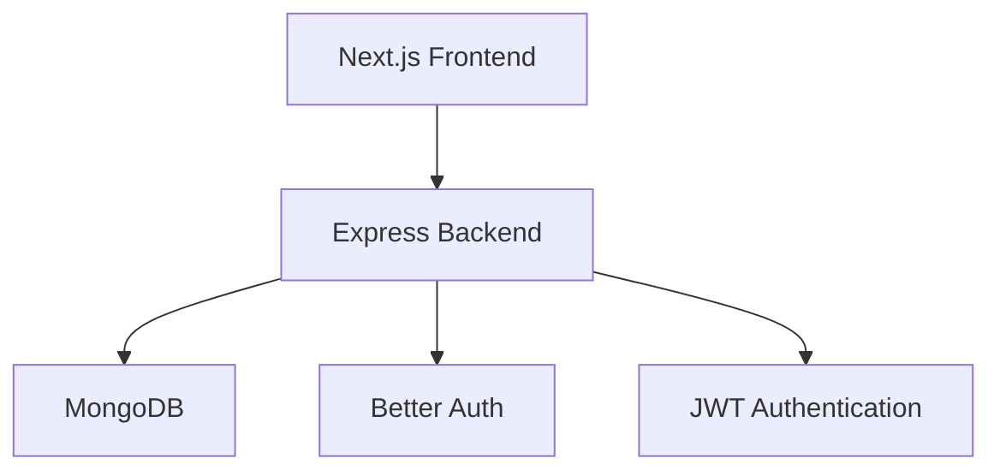

# 📚 BookNest – Community Book Sharing Platform

BookNest is a modern full-stack web application that enables users to share physical books and digital PDF resources within a community. Users can publish books, request to borrow books, manage their personal library through a personalized dashboard, and securely access approved digital resources. The platform also includes an admin dashboard for managing borrow requests and maintaining the platform.

---

## 🌐 Live Demo

* 🚀 **Live Site:** https://your-live-demo-link.com
* 💻 **Client Repository:** https://github.com/moajjem441/BookNest
* ⚙️ **Server Repository:** https://github.com/moajjem441/BookNest-server

---

## ✨ Key Features

* 🔐 Secure authentication using Better Auth with JWT.
* 📚 Share both physical books and PDF resources.
* 📩 Borrow request system with approval workflow.
* 👤 Personalized user dashboard with real-time statistics.
* 🛡️ Role-based admin dashboard for request management.
* 📱 Fully responsive modern UI.
* 🎨 Smooth animations with Framer Motion.
* 🔒 Protected routes for authenticated users.
* ⚡ Fast and scalable architecture using Next.js and Express.

---

# 👤 User Dashboard

The user dashboard provides everything required to manage books and borrowing activities from one place.

### 📊 Dashboard Overview

Dynamic statistics cards displaying:

* Total Shared Books
* Pending Borrow Requests
* Currently Borrowed Books

### 📂 Sidebar Navigation

* 🏠 Dashboard Overview
* 📚 My Shared Books
* 📬 Borrow Requests
* 📖 Borrowed Books
* ➕ Share New Book

### 📚 Shared Books

Users can:

* Add new books
* Edit book information
* Delete shared books
* View borrowing status

### 📬 Borrow Requests

Track every request with status:

* Pending
* Approved
* Rejected

### 📖 Borrowed Books

After approval users can:

* View book details
* Read available PDF resources
* Track borrowed books

---

# 🛡️ Admin Dashboard

The admin dashboard provides complete platform management.

### Request Management

* Review borrow requests
* Approve requests
* Reject requests
* Delete invalid requests

### Book Management

* Remove inappropriate books
* Manage all shared books
* Monitor inventory

### Automatic Book Status Synchronization

When an admin approves a borrow request:

* Borrow request status becomes **Approved**
* Book status automatically changes to **Borrowed**

This keeps data synchronized across the platform.

### Platform Monitoring

Admin can monitor:

* Total users
* Total books
* Active borrow requests
* Platform activity

---

# 🔐 Authentication & Authorization

* Better Auth Authentication
* JWT Authorization
* Protected Routes
* Role-Based Access Control
* Session Management

---

# 📚 Book Management

Users can share books with:

* Title
* Author
* Category
* Description
* Cover Image
* Book Type (Physical/PDF)

---

# 📥 Borrow Workflow

1. User opens a book.
2. Clicks **Borrow Book**.
3. Borrow request is created.
4. Admin reviews the request.
5. Admin approves or rejects.
6. Book status updates automatically.
7. Approved users can access borrowed books.

---

# 📱 Responsive Design

Optimized for:

* Desktop
* Laptop
* Tablet
* Mobile

---

# 🛠️ Tech Stack

## Frontend

* Next.js 16
* React
* TypeScript
* Tailwind CSS
* Framer Motion
* Lucide React

---

## Backend

* Node.js
* Express.js
* MongoDB
* Better Auth
* JWT

---

## Development Tools

* TypeScript
* JavaScript
* Nodemon
* Dotenv
* Git
* GitHub

---

# 📁 Project Structure

```text
booknest/
├── src/
│   ├── app/
│   │   ├── admin/
│   │   ├── dashboard/
│   │   ├── books/
│   │   ├── share/
│   │   ├── borrowed-books/
│   │   ├── borrow-requests/
│   │   ├── my-books/
│   │   └── api/
│   │
│   ├── components/
│   ├── hooks/
│   ├── lib/
│   │   ├── auth.ts
│   │   ├── auth-client.ts
│   │   └── mongodb.ts
│   │
│   ├── types/
│   └── utils/
│
├── server/
│   ├── index.js
│   ├── middleware/
│   └── routes/
│
├── public/
├── .env.local
├── package.json
├── next.config.ts
└── tailwind.config.js
```

---

# 🗄️ Database Collections

```text
users
books
borrowRequests
```

---

# 📡 REST API Endpoints

| Method | Endpoint                        | Description               | Authentication |
| ------ | ------------------------------- | ------------------------- | -------------- |
| POST   | /books                          | Share a new book          | ✅              |
| GET    | /books                          | Get all books             | ❌              |
| GET    | /books/:id                      | Get book details          | ❌              |
| DELETE | /books/:id                      | Delete own book           | ✅              |
| POST   | /books/:id/request              | Borrow a book             | ✅              |
| GET    | /dashboard/books                | User dashboard statistics | ✅              |
| GET    | /dashboard/borrowRequests/email | User borrow requests      | ✅              |
| PATCH  | /borrow-requests/:id            | Approve/Reject request    | ✅ Admin        |
| GET    | /users/:id                      | User information          | ❌              |

---

# ⚙️ Environment Variables

## Frontend (.env.local)

```env
NEXT_PUBLIC_SERVER_URL=http://localhost:5000
NEXT_PUBLIC_BETTER_AUTH_URL=http://localhost:3000
```

## Backend (.env)

```env
PORT=5000
MONGODB_URI=your_mongodb_connection_string
CLIENT_URL=http://localhost:3000
JWT_SECRET=your_secret_key
```

---

# 🚀 Getting Started

## Prerequisites

* Node.js (v18+)
* npm or yarn
* MongoDB Atlas or Local MongoDB

---

## Installation

### Clone Repository

```bash
git clone https://github.com/yourusername/booknest.git

cd booknest
```

### Install Frontend

```bash
npm install
```

or

```bash
yarn install
```

### Install Backend

```bash
cd server

npm install

cd ..
```

---

## Start Backend

```bash
cd server

npm run dev
```

Server runs on:

```
http://localhost:5000
```

---

## Start Frontend

```bash
npm run dev
```

Application runs on:

```
http://localhost:3000
```

---

# 📷 Screenshots

Add screenshots inside a folder named **screenshots**.

```text
screenshots/
├── home.png
├── dashboard.png
├── admin.png
├── book-details.png
└── borrow-request.png
```

Example:

```md
## Home


## Dashboard


## Admin


```

---

# 🏗️ System Architecture



---

# 🚀 Deployment

| Service  | Platform      |
| -------- | ------------- |
| Frontend | Vercel        |
| Backend  | Render        |
| Database | MongoDB Atlas |

---

# 🔮 Future Improvements

* 📧 Email Notifications
* ⭐ Book Ratings
* 💬 User Messaging
* ❤️ Wishlist
* 🔎 Advanced Search & Filters
* 📅 Borrow Return Management
* 📖 Reading History
* 🌙 Dark Mode
* 🔔 Real-time Notifications

---

# 🤝 Contributing

Contributions, issues, and feature requests are welcome.

If you'd like to improve this project:

1. Fork the repository.
2. Create a feature branch.
3. Commit your changes.
4. Push to your branch.
5. Open a Pull Request.

---

# 📄 License

This project is licensed under the **MIT License**.

---

# 👨‍💻 Author

**Moajjem Hossain**

* GitHub: https://github.com/moajjem441/BookNest
* LinkedIn: https://www.linkedin.com/in/moajjem-hossain-

---

⭐ If you found this project useful, consider giving it a **Star** on GitHub.
